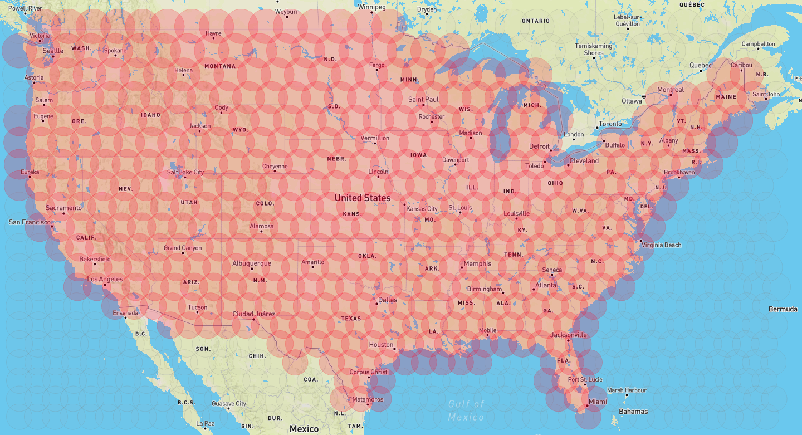

# mapcover

A simple tool based on [Leaflet](https://leafletjs.com/) to interactively
produce a list of latitude/longitude pairs that relatively tightly cover a
geographic region using a fixed radius.

## Usage

Click the bubbles to toggle. Click the map (outside of the bubbles) to dump the
coordinates of the selected bubbles to the console.

## Sample Screenshot

